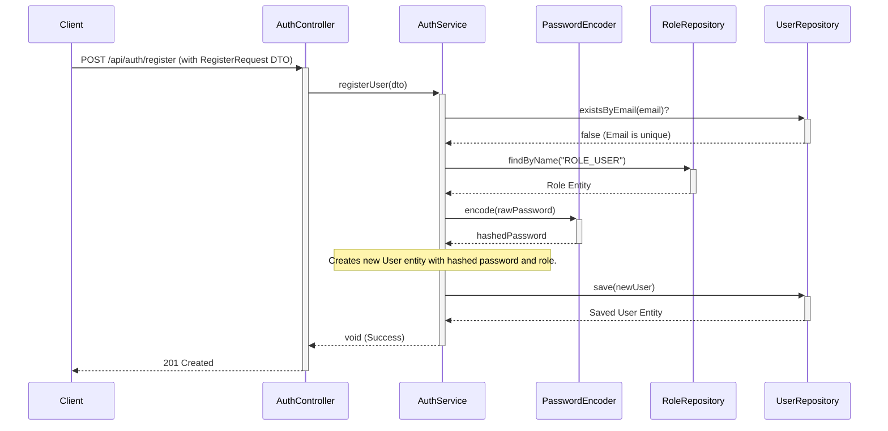
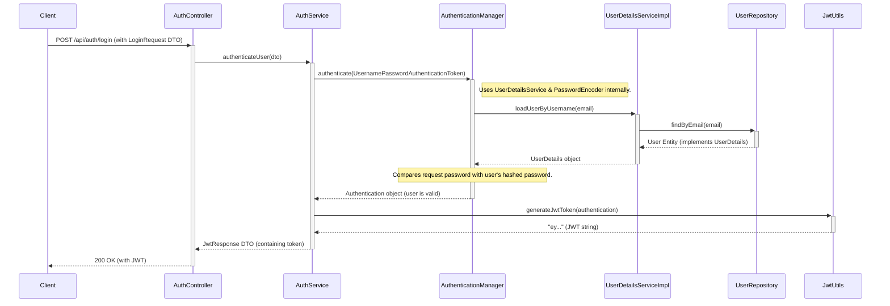
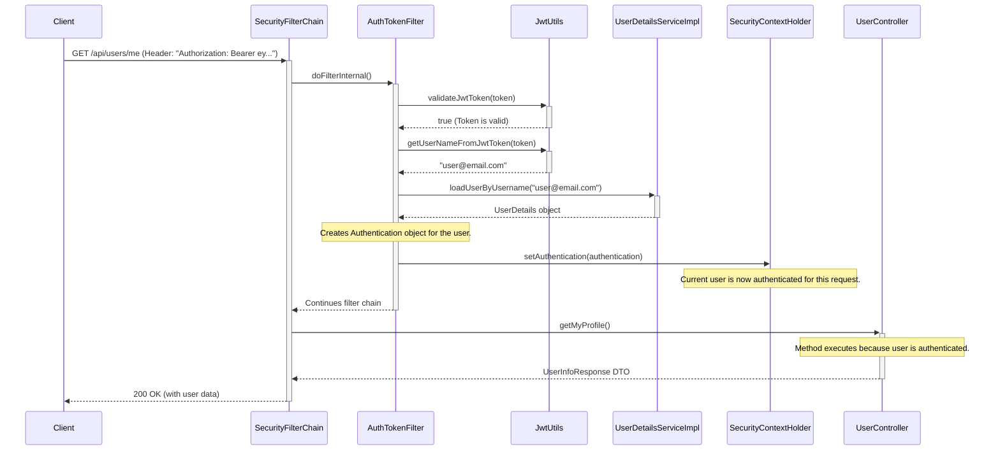

# User Service Authentication Flow

This document details the step-by-step process of user registration, authentication, and token-based authorization within the User Service. The system is designed as a stateless REST API, secured using JSON Web Tokens (JWT).

## Key Components

| Component                   | Role                                                                | Responsibility                                                                                       |
| --------------------------- | ------------------------------------------------------------------- | ---------------------------------------------------------------------------------------------------- |
| **`AuthController`**        | API Entry Point                                                     | Exposes `/register` and `/login` endpoints. Handles HTTP requests/responses. Delegates to `AuthService`.  |
| **`AuthService`**           | Business Logic Orchestrator                                         | Contains the core logic for user registration and authentication.                                    |
| **`SecurityConfig`**        | Security Rulebook                                                   | Configures the master security filter chain, defines public/private endpoints, and provides security beans. |
| **`AuthenticationManager`**   | Head of Security                                                    | A core Spring Security component that processes an authentication request.                           |
| **`UserDetailsServiceImpl`**| Records Officer                                                     | Implements `UserDetailsService` to load a user from the database by email.                         |
| **`PasswordEncoder`**       | Cryptography Specialist                                             | Hashes passwords for storage and securely compares passwords during login.                             |
| **`JwtUtils`**              | Token Factory & Inspector                                           | Generates, parses, and validates JWTs.                                                                 |
| **`AuthTokenFilter`**       | JWT Security Guard                                                  | A custom filter that runs on every request to validate the JWT and set the user's authentication.    |
| **`UserRepository`**        | The File Cabinet                                                    | Provides the data access layer to the `users` table.                                                 |
| **`User` Entity**           | The Employee File                                                   | Represents a user and also implements `UserDetails` to integrate with Spring Security.             |

---

## 1. User Registration Flow

This flow describes how a new user is created in the system.

# 2. User Login (Authentication) Flow

This flow describes how a registered user logs in and receives a JWT.

# 3. Accessing a Protected Resource (Authorization) Flow

